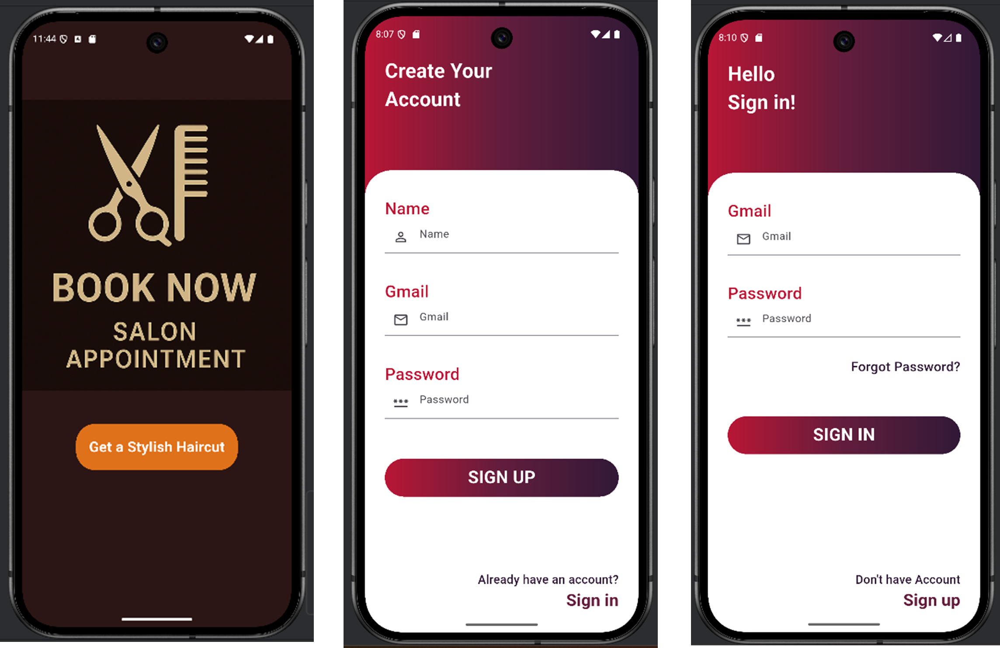

# Salon Reservation Mobile App  

A mobile application that streamlines salon appointment booking and management.  
Built with **Flutter** and powered by **Firebase** for authentication, real-time database, and backend services.  

---

## 📌 Features  

### Customer Features  
- **Simple Registration & Login** using Firebase Authentication with secure credential handling.  
- **Service Browsing**: Users can explore a variety of services such as haircuts, facials, and shaves, with clear pricing and descriptions.  
- **Appointment Booking**: Select a service, choose preferred date & time via an interactive calendar, and confirm bookings.  
- **Booking History**: Access both past and upcoming appointments in one place.  
- **User-Friendly Design** with an intuitive and clean interface for seamless navigation.  

### Staff Features  
- **Dedicated Admin Login Portal**: Secure staff authentication.  
- **Appointment Management**: Staff can view daily schedules, customer details, and service history.  
- **Real-Time Updates**: All new bookings, changes, or cancellations are instantly synced across devices.  

### System Features  
- **Real-Time Data Synchronization** with Firestore ensures no manual refresh is required.  
- **Secure Data Management** with Firebase Authentication and Firestore rules.  
- **Scalability**: Cloud-based backend supports growing user base and multiple salon branches.  
- **Efficiency**: Reduces administrative workload and eliminates manual errors.  

---

## 🛠️ Tech Stack  

- **Frontend:** Flutter (Dart)  
- **Backend:** Firebase Authentication, Firestore Database  
- **Architecture:** Cloud-based, modular, scalable  
- **IDE Used:** Android Studio  

---

## 📱 Screenshots  

### Onboarding & Authentication  
  

### Booking Flow  
  

### Admin Panel  
  

---

## 🔎 Methodology  

The development process followed a structured approach:  

1. **User Authentication Flow**  
   - The app first checks if the user is authenticated.  
   - Options: **Register** (create a new profile with email & password) or **Login** (verify credentials).  
   - Firebase Authentication secures the entire process.  

2. **Customer Workflow**  
   - Home Screen → View services → Select service → Choose date & time → Review booking → Confirm.  
   - Booking details and history are stored in Firestore for future reference.  

3. **Staff Workflow**  
   - Staff login via a dedicated **Admin Portal**.  
   - View customer appointments with details such as service type, time, and client name.  
   - Manage daily schedules efficiently.  

4. **Backend Integration**  
   - **Firebase Authentication** → Handles login, registration, and password reset.  
   - **Firestore Database** → Stores user profiles, service catalog, and bookings.  
   - **Real-Time Sync** → Ensures consistency across customer and staff interfaces.  

---

## 📊 Database Schema  

The system uses Firestore with three main collections:  

- **Users** → Stores customer account details (name, email, password).  
  
- **Admin** → Stores administrator credentials for staff login.  
  
- **Bookings** → Stores appointment records including service, customer, date, and time.  
  
---

## 📈 Advantages & Impact  

- **Customer Satisfaction**: Convenient mobile booking enhances user experience.  
- **Time Efficiency**: Automated scheduling minimizes phone calls and manual effort.  
- **Error Reduction**: Reduces double-bookings and mismanagement.  
- **Business Insights**: Data-driven records enable analysis of customer trends and popular services.  
- **Future Scalability**: Architecture supports adding features like payment gateways, reward systems, and AI-driven personalization.  

---

## ✅ Conclusion  

This mobile app transforms salon reservation systems by combining **ease of use for customers** and **efficiency for staff**.  
It leverages Firebase’s real-time cloud infrastructure to ensure secure, scalable, and reliable operations. The solution reduces manual work, enhances service delivery, and provides a strong foundation for future upgrades.  
